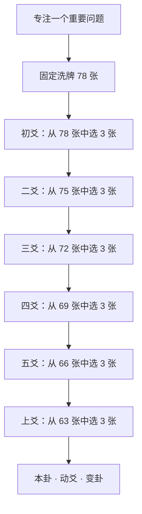

# bingbing's tarot

> 一间安静、克制的线上塔罗档案馆。<br>
> 在提问、洗牌、选牌与翻牌之间，为使用者保留真正参与占卜的空间。

[在线体验](https://bingbing-tarot.vercel.app/) · [更新日志](./CHANGELOG.md) · [万象归一设计规格](./docs/unity-spread-spec.md)

## 项目简介

`bingbing's tarot` 是一个基于 React 的多语言塔罗应用。项目没有把抽牌简化成“点击按钮后立即得到答案”，而是把一次阅读拆成提问、洗牌、浏览牌堆、主动选牌、逐张翻牌和阅读结果等连续阶段。

普通牌阵使用现有 78 张韦特塔罗牌档案、正逆位关键词和多语言牌义生成结构化解读；大型牌阵「万象归一」则以十八张塔罗映照六爻之象，生成本卦、动爻与变卦。

项目不接入外部大语言模型，也不会把静态模板包装成 AI 推理。自动解读来自可检查的牌义档案、牌阵位置和明确的组合规则。

## 核心体验


- 洗牌时一次性生成固定、无重复的随机牌序。
- 用户选择的牌背位置真实对应牌组中的牌，不在点击后临时随机。
- 牌堆支持鼠标拖动、滚轮、触控板和移动端滑动。
- 拖动与点击有明确阈值，降低滑动时误选牌的概率。
- 选满后仍需主动确认，不会在最后一次点击后自动跳转。
- 卡牌按选择顺序逐张翻开，正逆位标签保持正常阅读方向。

## 功能一览

### 四种牌阵

| 牌阵 | 牌数 | 适合的问题 | 当前能力 |
| --- | ---: | --- | --- |
| 三张牌阵 | 3 | 梳理一个问题中的三个主要线索 | 参与式选牌、逐张翻牌、结构化综合解读 |
| 圣三角牌阵 | 3 | 区分表面认知、实际状态和可行动出口 | 专属位置结构与综合解读 |
| 二选一牌阵 | 5 | 比较 A／B 两条路线的条件、发展与代价 | 双路线对照，不替用户直接作决定 |
| 万象归一阵 | 18 | 人生节点、长期方向、重大决策和复杂议题 | 六轮起卦、本卦、动爻、变卦、知识档案与历史回放 |

### 结构化塔罗解读

- 每张牌绑定实际牌阵位置、正逆位、档案关键词和完整牌义。
- 三张牌阵、圣三角和二选一分别使用独立的综合解读逻辑。
- 解读会结合全部已抽卡牌，不依赖第一张牌或通用关键词生成结论。
- 二选一分别展示 A 当前、A 发展、B 当前、B 发展和当事人位置。
- 结果使用结构化字段渲染，不通过空行或段落索引猜测内容类型。
- 表述避免绝对预测，不声称知道用户未提供的经历。

### 万象归一阵 · The Unity of All Things

「万象归一」是项目中的大型实验牌阵，遵循“易经为骨，塔罗为象”。



- 六轮起卦，每轮由用户从剩余牌池中选择三张，共十八张且不重复。
- 整次起卦只洗牌一次；刷新恢复时不会改变牌序和已完成轮次。
- 正位记为 `2`、逆位记为 `3`，每轮三张牌得到 `6 / 7 / 8 / 9`。
- `6` 为老阴、`7` 为少阳、`8` 为少阴、`9` 为老阳；老阴和老阳构成动爻。
- 六爻底层顺序固定为初爻到上爻，并按文王卦序识别本卦与变卦。
- 结果页把十八张塔罗的“象”和易经知识的“势”分区展示。
- 没有动爻时不会伪造变卦；知识内容缺失时也不会编造传统文本。
- 历史记录保存版本化 Snapshot，重新打开时直接读取快照，不重新起卦或计算。

目前万象归一已经完成入口、六轮选牌、六爻计算、基础知识接入、结果展示和本地历史档案。十八张塔罗与六爻的完整融合解读仍属于后续内容阶段。

### 其他功能

- 每日一牌与按月查看的日签档案。
- 78 张塔罗牌义档案与牌面图片。
- 正位／逆位与同一次抽牌去重。
- 最近三次普通解牌记录。
- 真人解牌请求、消息往来和金币扣除流程。
- Supabase 邮箱登录、用户资料、金币和普通牌阵历史同步。
- 中文、英文、意大利语界面，切换语言不会重新抽牌。
- 键盘选择、ARIA 状态、可见焦点和 `prefers-reduced-motion` 支持。
- 360px 到桌面宽屏的响应式布局。

## 适用场景

这个项目更适合用于自我观察，而不是寻找确定预言。

- 在复杂处境中梳理当前最值得关注的线索。
- 比较两个选择各自需要的条件、可能成本与发展方向。
- 观察关系、工作或个人目标中反复出现的模式。
- 为一次重要沟通、决定或阶段复盘整理思路。
- 以更慢、更有仪式感的方式完成一次私人塔罗阅读。
- 对“塔罗 × 传统六爻”的可验证交互与数据模型进行产品实验。

塔罗内容不替代医疗、法律、财务、心理健康或其他专业意见。涉及高风险问题时，请优先寻求合格的专业支持。

## 项目创新

### 1. 用户选择真实决定抽到的牌

系统先生成一次固定洗牌结果，再把每个可见牌背位置映射到真实卡牌。用户不是在系统预先发好的三张牌中“翻开答案”，而是从整副牌中选择；随机公平性、去重和参与感可以同时成立。

### 2. 解读不是逐张拼接固定牌义

普通牌阵的解读引擎读取用户问题、牌阵实际位置、正逆位、每张牌自己的档案关键词和完整牌义，再按牌阵类型组织综合解读。三张、圣三角和二选一拥有不同的结构，不使用同一段万能模板。

### 3. 将抽牌过程建模为可恢复状态机

洗牌、选择、确认、翻牌和阅读是明确阶段。万象归一进一步保存固定牌组、当前轮次、已选牌、翻牌进度和已完成爻位，因此刷新页面不会重新随机，也不会改变之前的选择。

### 4. 用透明算法连接塔罗与六爻

万象归一把正逆位映射为传统三币法中的 `2 / 3`，严格得到 `6 / 7 / 8 / 9`，再根据六爻顺序计算卦象。算法事实、知识内容和展示文案彼此分离，便于测试、审校和后续迭代。

### 5. Snapshot 优先的历史系统

历史详情读取当时保存的结果快照，不依赖当前算法重新计算。即使知识文本或界面以后更新，旧记录仍能保持当时的卡牌、正逆位、六爻和卦象关系。

### 6. 一套贯穿全站的视觉语言

界面没有采用常见的紫色渐变或玻璃拟态，而是围绕深黑／墨绿宇宙、太阳金、旧纸张、手稿、星轨和档案编号建立“私人占卜室 × 古老天文档案馆”的视觉系统。

## 技术栈

- React 18
- Vite 5
- Framer Motion
- Lucide React
- Supabase Auth / Database
- 原生 Pointer Events、CSS scroll 和 Web Storage
- Node.js 脚本测试

## 代码结构

```text
src/
├── components/             # 抽牌、牌面、阅读和万象归一组件
├── data/unity/             # 八卦、六十四卦结构及已核验知识内容
├── i18n/locales/           # 中文、英文、意大利语界面文案
├── pages/                  # 首页、抽牌、结果、档案等页面
├── cardDrawFlow.js         # 普通牌阵参与式抽牌状态
├── readingEngine.js        # 结构化塔罗解读引擎
├── unityAlgorithm.js       # 冻结的六爻与卦象计算
├── unityCastingFlow.js     # 万象归一六轮选牌状态
└── unityHistoryStore.js    # 万象归一 Snapshot 历史

scripts/
├── run-tests.js            # 基础功能测试
├── run-draw-tests.js       # 普通抽牌与解读测试
└── run-unity-tests.js      # 万象归一算法、流程与历史测试
```

## 本地运行

环境要求：Node.js 18+。

```bash
npm install
cp .env.example .env
npm run dev
```

Windows PowerShell 可以使用：

```powershell
Copy-Item .env.example .env
npm run dev
```

在 `.env` 中填写自己的 Supabase 项目配置：

```env
VITE_SUPABASE_URL=https://your-project.supabase.co
VITE_SUPABASE_ANON_KEY=your-anon-key
```

## 测试与构建

```bash
npm test
npm run build
```

当前测试覆盖普通三张牌阵、圣三角、二选一、正逆位、无重复抽牌、多语言切换、万象归一六轮起卦、卦象计算、刷新恢复和 Snapshot 历史回放等关键场景。

## 数据与内容边界

- 新环境部署需要配置 `.env`，并按仓库根目录中的 SQL 脚本初始化相应 Supabase 数据；前端不会自动迁移数据库结构。
- 普通牌阵历史会同步到 Supabase，并保留本地最近记录作为界面缓存。
- 万象归一起卦草稿、完成结果和历史快照目前保存在浏览器本地，并按用户昵称隔离。
- 塔罗牌义复用现有牌义档案，不复制另一套 78 张硬编码内容。
- 易经原文和现代解释使用不同字段；缺少已核验内容时明确显示缺失状态。
- 项目当前不调用任何外部大语言模型 API，不需要模型 API Key。

## 设计与规则文档

- [视觉系统](./docs/visual-redesign-system.md)
- [万象归一牌阵规格](./docs/unity-spread-spec.md)
- [万象归一数据模型](./docs/unity-data-model.md)
- [万象归一算法](./docs/unity-algorithm.md)
- [万象归一知识库](./docs/unity-knowledge-base.md)

## 更新记录

近期变更见 [CHANGELOG.md](./CHANGELOG.md)。
