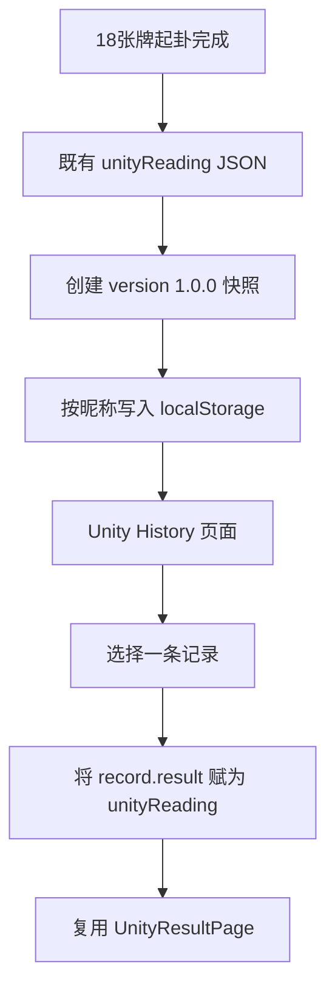

# 万象归一阵历史记录系统设计

## 目标与范围

为万象归一阵增加独立的历史记录能力：每次起卦完成后自动保存一份版本化、不可变的结果快照；用户可在独立历史页检索、回看、删除单条记录或清空全部记录。

本阶段不修改起卦算法、抽牌流程、起卦结果结构或既有三个牌阵。历史详情严格读取已存档 JSON，绝不重新调用起卦计算。

## 存储策略

历史记录沿用项目现有的按昵称隔离的浏览器本地存储模式：

```text
tarot_unity_history_<nickname-or-guest>
```

每条记录是一个独立的可迁移快照：

```json
{
  "id": "uuid",
  "version": "1.0.0",
  "createdAt": "ISO-8601 timestamp",
  "primaryHexagramNumber": 40,
  "changedHexagramNumber": 60,
  "movingLineIndexes": [1, 4, 5],
  "result": { "completeUnityReadingJson": true }
}
```

`result` 保存完整的万象归一起卦结果 JSON，不在读取时补算、修正或根据新算法覆写。顶部索引字段仅用于列表、排序与搜索；其内容也从当次 JSON 快照派生。

本地存储层与页面解耦，未来云端迁移只需上传或下载同一条记录对象，无需改变结果页读取方式。

## 模块边界

### `src/unityHistoryStore.js`

唯一负责：

- 生成 UUID；
- 将 `unityReading` 封装为版本化记录；
- 从指定昵称键读取、校验、规范化和按时间倒序排列记录；
- 写入、删除单条和清空；
- 以“卦号文本或日期文本”为条件过滤已读取记录。

该模块不调用起卦算法、不处理 React 状态、不生成页面文案。

### `src/pages/UnityHistoryPage.jsx`

独立 History 页面，显示：

- 搜索输入；
- 时间倒序列表；
- 每条的日期、时间、本卦编号、存在动爻时的变卦编号、动爻数量；
- 打开详情、删除、清空入口；
- 空状态与删除确认。

列表只使用记录索引字段；点击详情将完整 `result` 交回应用状态。

### `src/App.jsx`

仅增加 Unity 历史状态和路由式页面切换：

1. 完成万象归一起卦并得到 `unityReading` 后，自动创建并保存一次快照；
2. 打开历史页时读取当前昵称对应的快照；
3. 点击详情时把该记录的 `result` 赋给 `unityReading` 并切换到既有 `UnityResultPage`；
4. 删除和清空后更新本地状态；
5. 传递结果页的“打开历史”入口。

不会更改 `calculateUnityReading`，也不会把 Unity 记录加入普通的 `recentReadings` 或既有 HistoryModal。

### `src/pages/UnityResultPage.jsx`

只新增一个“查看历史”入口回调，不改变当前展示所依赖的 JSON 数据。历史详情页与新起卦结果页使用同一组件，因此视觉与读取路径一致。

## 数据流



## 搜索与排序

- 排序：`createdAt` 降序，最新记录在最前。
- 卦名搜索：MVP 知识库尚未包含六十四卦名称，因此将“卦名”解释为可见的本卦/变卦编号（例如 `40`、`60`）以及未来可补充的名称字段。搜索层会同时检查编号和已存 `hexagramName` 可选字段，不伪造卦名内容。
- 日期搜索：匹配本地格式化日期与 ISO 日期前缀，支持用户输入 `2026-07-18` 或界面显示的日期片段。

## 删除安全性

- 单条删除与清空全部均要求浏览器确认对话框；取消时不得修改记录。
- 清空只影响当前昵称的万象归一记录键，不影响普通解读、日运、账户或其他用户的本地数据。

## 兼容性与错误处理

- 新记录固定写入 `version: "1.0.0"`。
- 读取时跳过空值、非对象、缺少 `result`、或缺少六轮结果的损坏项；合法旧项保持原 JSON。
- 若浏览器存储不可用或 JSON 损坏，历史页显示空状态，当前占卜和起卦结果仍可正常使用。
- 不写入任何解读、卦辞或 AI 结果；将来新增此类字段只能追加到 `result` 或记录索引，不能改写已存快照。

## 验证范围

自动化测试至少覆盖：

1. 快照创建包含 UUID、版本、时间、六轮、卦象、动爻和完整 JSON；
2. 读取按日期倒序且按昵称隔离；
3. 按卦号和日期可筛选；
4. 单条删除和清空不会影响其他昵称键；
5. 详情路径不导入或调用起卦算法；
6. 页面包含历史列表、搜索、确认删除与复用结果页入口。

生产验证执行 `npm test` 和 `npm run build`。
