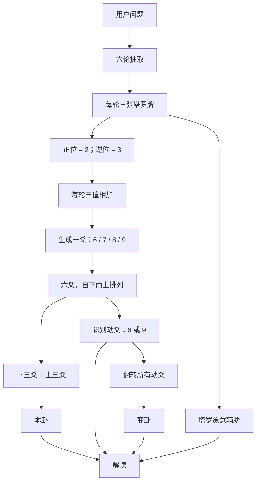
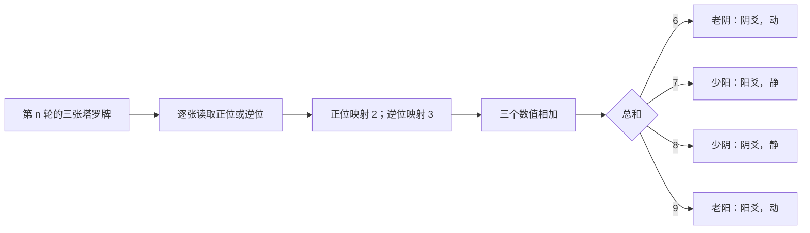
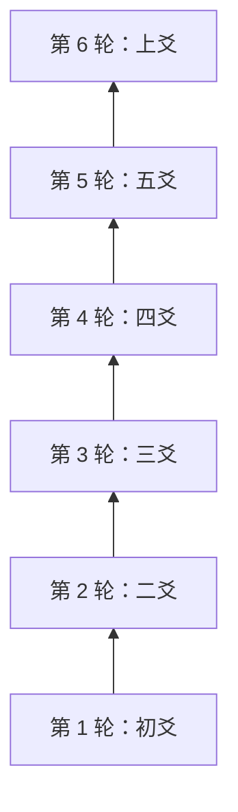
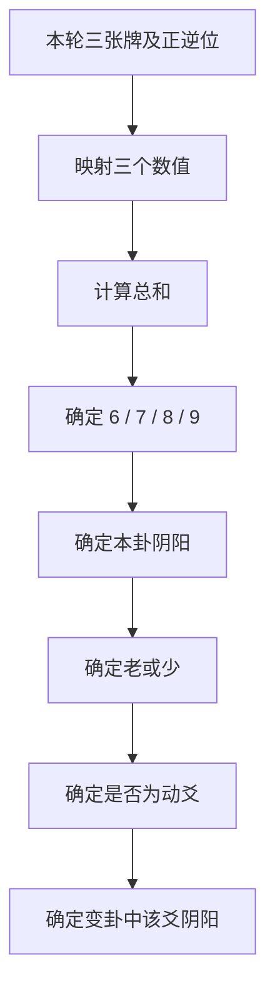
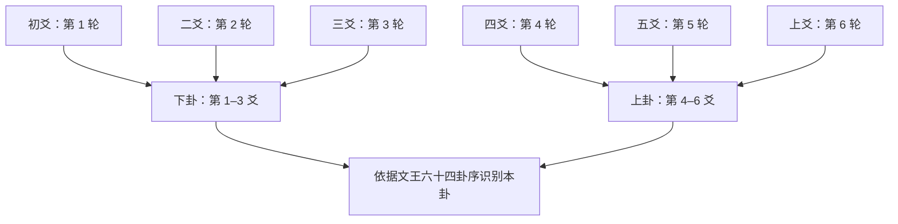
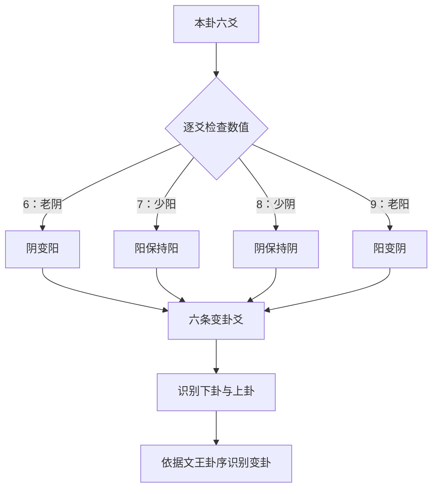
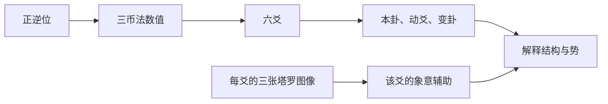
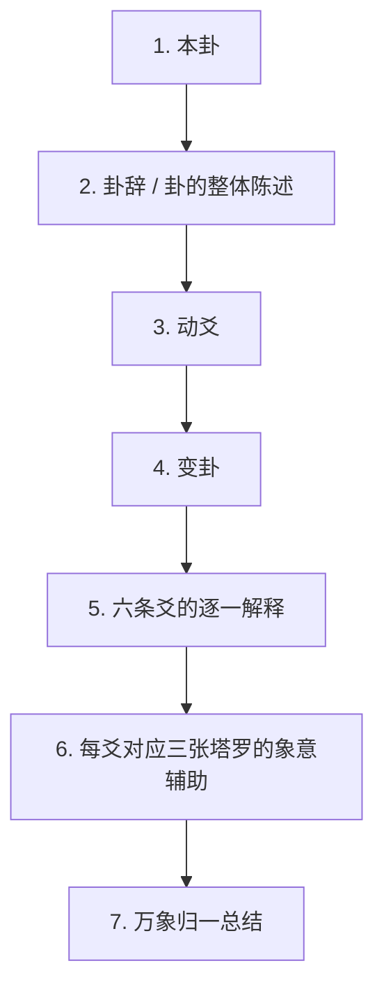

# 万象归一阵算法规范 / The Unity of All Things Algorithm

## 文档状态

- 类型：规范性算法文档
- 适用范围：万象归一阵的计算、推导、解释顺序与未来扩展边界
- 非范围：任何代码、界面、数据库表、接口、随机抽取机制或 AI 调用实现
- 规范地位：本文是万象归一阵算法的单一事实来源；与产品规格和数据模型共同构成未来实现的冻结依据。

---

# 1. 总体流程

万象归一阵以一个用户问题为起点，完成六轮、每轮三张牌的抽取。每张牌的正逆位只承担传统三币法的数值作用；六次求和生成六爻，再由六爻得到本卦、动爻与变卦。解释必须以易经结构为先，以塔罗图像为辅助。

## 1.1 固定输入与固定输出

| 阶段 | 固定输入 | 固定输出 |
| --- | --- | --- |
| 提问 | 一个聚焦的用户问题 | 同一次仪式中不再更改的问题快照 |
| 抽取 | 6 轮 × 每轮 3 张塔罗牌 | 18 张牌与其正逆位 |
| 映射 | 每张牌的正逆位 | 每张牌的数值 2 或 3 |
| 成爻 | 每轮三个数值 | 1 条值为 6、7、8 或 9 的爻 |
| 成卦 | 六条本卦爻 | 下卦、上卦与本卦 |
| 变卦 | 所有动爻 | 变卦 |
| 解读 | 问题、卦、爻、变卦与牌 | 先卦后牌的完整阅读 |

## 1.2 不可变前提

1. 一次完整阅读固定为六轮，共 18 张牌；不能增减轮次或每轮牌数。
2. 第 1 轮永远生成最下方的初爻，第 6 轮永远生成最上方的上爻。
3. 正位只映射为 2，逆位只映射为 3；不得依据牌名、牌组或牌义改变数值。
4. 每轮总和只可能是 6、7、8、9；不得平均、重掷、修正或创造其他结果。
5. 只有 6 和 9 是动爻；所有动爻同时变化后，才得到变卦。
6. 本卦、动爻、变卦构成解释的结构与动势；塔罗只提供对应爻的象意辅助。

---

# 2. 传统三币法映射

## 2.1 映射规则

万象归一阵严格遵循传统三币法的数值累加逻辑，只是以塔罗牌正逆位代替每枚钱币的数值结果：

| 塔罗状态 | 固定数值 | 对应逻辑 |
| --- | ---: | --- |
| 正位（Upright） | 2 | 阴面计数 |
| 逆位（Reversed） | 3 | 阳面计数 |

每一轮抽出三张牌，并将三张的数值直接相加。

## 2.2 四种且仅有四种结果

| 三张牌正逆组合 | 数值计算 | 结果 | 本卦爻性 | 是否动爻 | 变卦中的该爻 |
| --- | --- | --- | --- | --- | --- |
| 三张正位 | 2 + 2 + 2 = 6 | 老阴 | 阴 | 是 | 阴变阳 |
| 两张正位、一张逆位 | 2 + 2 + 3 = 7 | 少阳 | 阳 | 否 | 保持阳 |
| 一张正位、两张逆位 | 2 + 3 + 3 = 8 | 少阴 | 阴 | 否 | 保持阴 |
| 三张逆位 | 3 + 3 + 3 = 9 | 老阳 | 阳 | 是 | 阳变阴 |

## 2.3 结果含义

### 6：老阴（动爻）

- 本卦中为阴爻。
- 属于“老”，因此是动爻。
- 生成变卦时，该爻必须翻转为阳爻。
- 它表示阴性状态正处于变化节点；具体解释仍须服从爻位、本卦、动爻关系与变卦。

### 7：少阳（静爻）

- 本卦中为阳爻。
- 属于“少”，因此不是动爻。
- 生成变卦时保持阳爻不变。

### 8：少阴（静爻）

- 本卦中为阴爻。
- 属于“少”，因此不是动爻。
- 生成变卦时保持阴爻不变。

### 9：老阳（动爻）

- 本卦中为阳爻。
- 属于“老”，因此是动爻。
- 生成变卦时，该爻必须翻转为阴爻。
- 它表示阳性状态正处于变化节点；具体解释仍须服从爻位、本卦、动爻关系与变卦。

## 2.4 禁止的替代算法

以下做法均不属于万象归一阵：

- 由塔罗牌的传统牌义、牌组、编号、元素或正逆位强弱来重新计算数值；
- 将三张牌加权、平均或按抽取顺序赋予不同数值；
- 为得到“更好的卦”而重抽某一轮；
- 把 6/7/8/9 以外的数值解释成额外爻型；
- 将任意一张牌单独视为一条爻。

---

# 3. 六爻生成

## 3.1 六轮与爻位的固定对应

| 轮次 | 生成爻位 | 传统名称 | 卦中位置 |
| ---: | --- | --- | --- |
| 第 1 轮 | 第 1 爻 | 初爻 | 最下方 |
| 第 2 轮 | 第 2 爻 | 二爻 | 自下而上第 2 条 |
| 第 3 轮 | 第 3 爻 | 三爻 | 自下而上第 3 条 |
| 第 4 轮 | 第 4 爻 | 四爻 | 自下而上第 4 条 |
| 第 5 轮 | 第 5 爻 | 五爻 | 自下而上第 5 条 |
| 第 6 轮 | 第 6 爻 | 上爻 | 最上方 |

## 3.2 为什么第 1 轮必须是最下方的初爻

六爻的生成传统是由下而上：先立根基，再形成下卦，随后进入上卦，最终到达上爻。因此第一个生成的结果不是视觉上“排在最前”的顶线，而是卦的基础——初爻。

这一规则同时保障三个层面一致：

1. **计算一致性**：第 1–3 轮可以直接组成下卦，第 4–6 轮可以直接组成上卦。
2. **传统一致性**：动爻、爻辞和爻位都以初、二、三、四、五、上的自下而上顺序理解。
3. **数据一致性**：历史回放、分享、AI 解读和多语言展示不因页面把上爻放在视觉顶部而改变计算次序。

页面可以用任何视觉形式呈现六爻，但不得改变、反转或省略这一生成顺序。

## 3.3 单轮成爻的闭环

每一轮都必须完成以下闭环，才可进入下一轮或生成后续卦象：

完成六个闭环后，才存在完整的六爻集合。不得在六爻不完整时宣布本卦、动爻列表或变卦。

---

# 4. 本卦生成

## 4.1 六爻、上下卦与本卦

本卦由六条**本卦爻线**构成；不使用翻转后的动爻来识别本卦。

生成步骤固定如下：

1. 按第 1 爻到第 6 爻的顺序读取每一轮的本卦阴阳。
2. 将第 1、2、3 爻识别为下卦；其内部仍按自下而上读取。
3. 将第 4、5、6 爻识别为上卦；其内部仍按自下而上读取。
4. 由下卦与上卦的组合，依据《周易》文王六十四卦序识别本卦的编号、名称和资料引用。

## 4.2 八卦的线型约定

下表中的顺序始终是“下、中、上”，即每组三条爻从低到高的顺序：

| 八卦 | 线型（下 → 上） |
| --- | --- |
| 乾 | 阳、阳、阳 |
| 兑 | 阳、阳、阴 |
| 离 | 阳、阴、阳 |
| 震 | 阳、阴、阴 |
| 巽 | 阴、阳、阳 |
| 坎 | 阴、阳、阴 |
| 艮 | 阴、阴、阳 |
| 坤 | 阴、阴、阴 |

卦名、卦序和卦辞必须来自同一版本化的文王卦序资料来源。算法只定义“根据上下卦识别本卦”，不在此文档中复制或创造卦辞。

## 4.3 本卦的意义边界

本卦代表提问时刻的整体格局、结构关系和正在运行的势。它不是确定的未来结论，也不是由 18 张塔罗牌独立拼出的故事。

---

# 5. 动爻与变卦

## 5.1 动爻识别

对每一条已生成的爻，按其数值识别：

| 爻值 | 是否动爻 | 本卦爻 | 变卦爻 |
| ---: | --- | --- | --- |
| 6 | 是，老阴 | 阴 | 阳 |
| 7 | 否，少阳 | 阳 | 阳 |
| 8 | 否，少阴 | 阴 | 阴 |
| 9 | 是，老阳 | 阳 | 阴 |

动爻列表必须记录所有动爻的爻位，使用 1–6 的索引并从小到大排序；例如 `[1, 4, 6]` 表示初爻、四爻和上爻同时发动。

## 5.2 变卦生成规则

变卦不是再抽一次牌，也不是为本卦选择一个“更好的结果”。它是将本卦中所有动爻同时翻转后的新六爻结构。

生成变卦的步骤：

1. 保留六条爻原有的自下而上位置。
2. 对值为 6 的爻，将阴翻为阳；对值为 9 的爻，将阳翻为阴。
3. 值为 7、8 的静爻完全保持不变。
4. 将得到的六条变卦爻分为第 1–3 爻的下卦和第 4–6 爻的上卦。
5. 以相同的文王卦序资料识别变卦。

## 5.3 无动爻情形

若六轮中不存在 6 或 9：

- 动爻列表为空；
- 六条变卦爻与本卦六爻完全相同；
- 变卦与本卦相同；
- 解释应如实说明结构暂时稳定、守成或尚未形成明确转折，而不能为了制造戏剧性强行添加变化。

## 5.4 动爻的解释地位

动爻是本卦与变卦之间的转换节点，必须在整体本卦之后、变卦之前被单独识别和说明。动爻不是独立于本卦的“额外抽牌结果”，也不代表绝对好坏。

---

# 6. 塔罗的强制定位

以下规则是万象归一阵不可被实现、文案或 AI 改写的核心原则：

> **塔罗不决定卦象。易经决定结构与势；塔罗只为对应的爻提供象意辅助。塔罗永远不能覆盖、推翻或替代易经结果。**

## 6.1 塔罗的允许职责

每一轮的三张牌只可用于：

1. 通过正逆位映射为 2 或 3，从而参与该轮爻值的生成；
2. 在该爻已经由数值确定之后，补充该爻所涉及的内在状态、现实关系、情绪、资源、张力或行动线索；
3. 帮助将同一条爻的抽象结构转化为可被用户观察的具体图像。

三张牌并不被赋予另一套“过去／现在／未来”或固定独立牌位；它们共同服务于所在的一条爻。

## 6.2 塔罗的禁止职责

塔罗不得：

- 单独确定本卦、下卦、上卦、动爻或变卦；
- 因牌义“看起来更强”而改变 6、7、8、9 的计算；
- 覆盖本卦、动爻或变卦的解释；
- 被解释为与六爻平行、互相竞争的第二套预测体系；
- 先被逐张自由联想，再把易经结果作为装饰性标签补上。

## 6.3 正确的依赖关系

图中 `D → E` 是解释的主轴。塔罗辅助只能进入其所属爻的解释，不能反向改写 `C` 或 `D`。

---

# 7. 永久解释流水线

以下顺序是面向用户、人工编辑与未来 AI 的永久解释管线。不得因为某张塔罗牌更显眼而跳过或交换步骤。

## 7.1 固定顺序与目的

1. **本卦**：说明当下整体格局和主导之势。
2. **卦辞／卦的整体陈述**：引用或释义经版本化资料来源中的卦级内容，为本卦建立语境。
3. **动爻**：标示变化集中在哪里、由何种爻性转化为另一种爻性。
4. **变卦**：说明动势充分展开后形成的后续结构；不是最终命运或价值判断。
5. **六条爻的逐一解释**：严格从初爻到上爻，先说爻在本卦中的位置、作用、约束与机会。
6. **每爻的三张塔罗辅助**：在该爻解释之后，再将三张牌作为该爻的象意证据；不得脱离爻位单独罗列成结论。
7. **万象归一总结**：回到用户的问题，整合内在状态、现实条件和自然趋势，提出可反思的观察与行动边界，而非断言式预言。

## 7.2 解读语言边界

解释应该描述“结构、倾向、关系、阶段、变化与可观察的调整”，不应承诺事情一定发生、精确预测日期或代替医疗、法律、金融与安全等专业判断。

---

# 8. 未来扩展点

本节只定义可扩展边界，不增加任何新的计算规则。任何未来功能都必须保留前述算法不变量。

## 8.1 AI 解读

未来 AI 可以读取问题、六轮、六爻、本卦、动爻、变卦以及版本化的卦辞／爻辞和塔罗资料。其输出必须遵守第 7 章的顺序：先卦、后爻、再以塔罗辅助。

AI 应保存模型、提示词、资料来源和生成时间等溯源信息，并保存不可变的解读快照。以新模型或新资料“再解读”时，只能追加版本，不能改写原阅读的计算结果或历史解读。

## 8.2 历史回放

历史回放应能复现：原始问题快照、18 张牌与正逆位、每轮数值、六爻、本卦、动爻、变卦以及当时的解释快照。回放展示可以变化，但不得重算或篡改历史结果。

## 8.3 分享

分享功能应以冻结的阅读快照为基础，并允许隐去用户问题、所有者标识和内部 AI 元数据。分享状态的变化不得影响原阅读的六爻计算和解释版本。

## 8.4 多语言

多语言仅改变显示文本，不改变：

- 正位 = 2、逆位 = 3 的映射；
- 6／7／8／9 的爻型；
- 初爻到上爻的自下而上顺序；
- 文王卦序；
- 本卦 → 动爻 → 变卦 → 六爻 → 塔罗辅助的解释顺序。

牌名、卦名、卦辞、爻辞与解释文本应按语言分别版本化，同时维持同一个爻位和卦象身份。

## 8.5 分析与统计

未来分析可以基于匿名化、授权后的历史数据研究使用频率、完成率、动爻分布或牌面分布。分析数据不得反向影响任意单次阅读的抽取、映射、成卦或解读结果，也不得将私密问题文本当作默认分析素材。

---

# 9. 最终算法速查

1. 固定同一问题，进行六轮抽取。
2. 每轮三张塔罗；正位记 2，逆位记 3。
3. 每轮相加生成 6、7、8 或 9，并依次形成初、二、三、四、五、上六爻。
4. 第 1–3 爻为下卦，第 4–6 爻为上卦；以文王卦序识别本卦。
5. 6 和 9 为动爻；6 阴变阳，9 阳变阴；7、8 不变。
6. 将所有动爻同时翻转，以同一规则识别变卦；无动爻时变卦等于本卦。
7. 永远按“本卦 → 卦级陈述 → 动爻 → 变卦 → 六爻 → 每爻三张塔罗 → 万象归一总结”解释。
8. 易经决定结构与势，塔罗提供象意辅助；塔罗永不覆盖易经结果。
