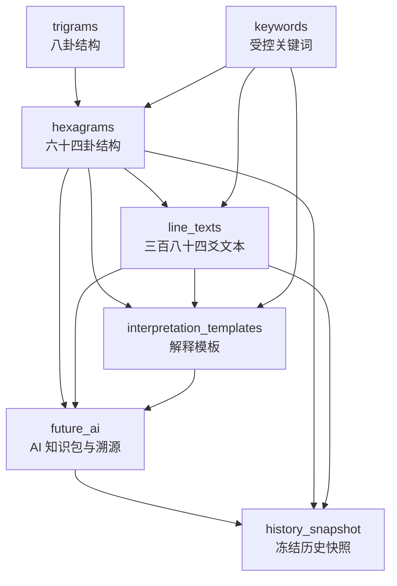
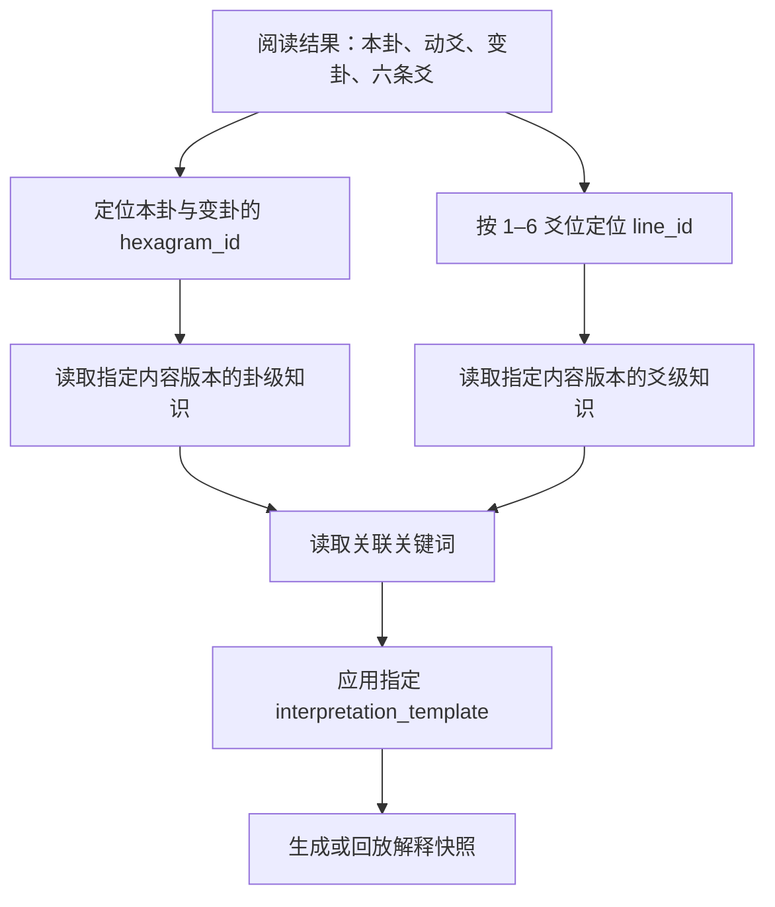

# 万象归一阵知识库架构 / The Unity of All Things Knowledge Base Architecture

## 文档目的与范围

本文定义万象归一阵未来所需的易经知识库蓝图：内容应如何被拆分、标识、版本化、翻译、引用和回放。它只定义架构和数据形态，不提供任何 64 卦、384 爻、卦辞、爻辞、译文、关键词或解读内容。

本文中的“模块”是逻辑知识域，不要求以任何特定数据库、文件格式、接口或前端技术实现。未来实现可以采用文件、内容管理系统、数据库或服务，但必须保留本文定义的稳定身份、引用关系和版本语义。

---

# 1. 总体架构

## 1.1 架构目标

知识库必须同时满足：

1. **传统结构可验证**：卦序、上下卦、六爻位置与动静规则能被准确关联。
2. **内容可独立更新**：卦级文字、爻级文字、关键词、现代说明和模板可以分批更新，不改动卦象身份。
3. **多语言可并行**：中文、英文、日文、意大利文使用同一知识身份，但各自拥有独立文本和审校状态。
4. **历史可回放**：旧阅读可引用当时的知识版本与解读快照，不被后续文本更新覆盖。
5. **AI 可溯源**：未来 AI 只能基于指定知识版本生成解释，且输出可追溯到所引用的卦、爻和资料版本。
6. **易经为主、塔罗为辅**：知识库应先提供本卦、变卦与爻的结构性资料；塔罗资料只能作为对应爻的辅助上下文，不能变成并行的主结论。

## 1.2 模块关系

## 1.3 三类信息的分离

知识库必须把以下三类信息分开管理：

| 信息类别 | 内容 | 是否可随版本更新 | 示例模块 |
| --- | --- | --- | --- |
| 结构事实 | 卦序号、上下卦、爻位、阴阳、Unicode 符号 | 仅更正时更新，需显式迁移 | `trigrams`、`hexagrams`、`line_texts` 的结构字段 |
| 可编辑知识 | 卦辞、译文、现代说明、关键词、主题、提醒、引导 | 可以新增版本 | `hexagrams`、`line_texts`、`keywords`、`interpretation_templates` |
| 生成与历史材料 | AI 输入、生成结果、用户历史引用、分享副本 | 只能追加或冻结，不应覆盖原记录 | `future_ai`、`history_snapshot` |

稳定结构身份与可编辑文本必须分离。这样可以修订译文或补充说明，却不会让“第几卦、哪一爻、属于哪个上下卦”的历史引用失效。

---

# 2. 必需数据模块

## 2.1 模块总览

| 模块 | 责任 | 不负责的内容 |
| --- | --- | --- |
| `hexagrams` | 保存每一卦的稳定身份、上下卦关系与卦级知识入口 | 不保存六条爻的完整文本副本 |
| `trigrams` | 保存八卦的稳定身份、三爻线型与基础象征入口 | 不直接决定某一阅读的本卦或变卦 |
| `line_texts` | 保存某一卦、某一爻的结构与爻级知识入口 | 不改变三币法产生的爻值 |
| `keywords` | 保存可复用、可翻译、可版本化的受控语义标签 | 不取代卦辞、爻辞或完整解释 |
| `interpretation_templates` | 保存解释的固定组织框架与内容槽位 | 不生成具体用户答案或占卜结论 |
| `future_ai` | 保存未来 AI 可读取的知识包、来源与规则引用 | 不保存或改变卦象计算规则 |
| `history_snapshot` | 保存某次阅读当时使用的知识引用与冻结副本 | 不充当可编辑的知识源 |

## 2.2 `hexagrams`

**责任**：提供六十四卦的卦级身份、结构关系和所有卦级知识的稳定入口。它是本卦与变卦识别后最先被引用的模块。

**存在原因**：同一卦在多个阅读、语言、解释模板与 AI 请求中反复出现。将其作为独立模块，能避免把卦级内容复制到每一条爻或每次阅读中。

## 2.3 `trigrams`

**责任**：提供八卦的稳定身份、下到上的三条线型、Unicode 符号与基础结构关系。

**存在原因**：算法先由第 1–3 爻识别下卦、由第 4–6 爻识别上卦。将八卦独立，可验证本卦／变卦的组成，也可避免在 64 卦中重复维护八卦线型。

## 2.4 `line_texts`

**责任**：保存一卦中每一个固定爻位的爻级知识。理论总量为 64 × 6 = 384 条，每条都通过“卦序号 + 爻位”唯一定位。

**存在原因**：爻辞与现代释义不能只附在卦级对象内。单独模块允许每一爻拥有独立版本、翻译、关键词、动爻提醒与引用来源，并能被六爻解释管线精确引用。

## 2.5 `keywords`

**责任**：维护受控关键词的稳定 ID、各语言名称、定义、同义词和适用范围，供卦、爻、模板和未来 AI 共同引用。

**存在原因**：将“关系、时机、边界、承接、转折”等概念写成自由文本会造成翻译不一致、筛选困难和 AI 语义漂移。关键词模块让不同内容对象引用同一语义身份，而不是复制相似词语。

## 2.6 `interpretation_templates`

**责任**：定义阅读输出的固定组织结构、每个槽位应引用的知识范围、语言风格约束与安全边界。

**存在原因**：模板使人工编辑、未来 AI 与不同语言版本都遵守同一解释顺序：本卦 → 卦级陈述 → 动爻 → 变卦 → 六爻 → 每爻塔罗辅助 → 万象归一总结。

## 2.7 `future_ai`

**责任**：定义未来 AI 可使用的知识包、引用的版本、输入边界、输出溯源和安全策略引用。

**存在原因**：AI 不能凭空补造卦辞或爻辞。独立模块可以让每次生成明确绑定到一组经过审核的知识版本，并防止模型把塔罗解释置于易经结构之前。

## 2.8 `history_snapshot`

**责任**：保存一次已完成阅读在某个时刻所引用的知识版本、文本副本和解释快照。

**存在原因**：知识库后续会修订译文、增加语言或优化现代说明。历史快照确保旧阅读仍能以当时内容被准确回放、分享和审计，不因内容更新而悄然改变。

---

# 3. `hexagrams`：卦级结构蓝图

## 3.1 身份与结构字段

每一个卦对象应包含以下字段。字段名仅作为跨系统概念名称，不构成任何实现语言或存储格式要求。

| 字段 | 含义 | 规则 |
| --- | --- | --- |
| `hexagram_id` | 稳定、不可复用的内部身份 | 不应以翻译后的名称作为主键 |
| `king_wen_number` | 文王六十四卦序号 | 范围 1–64，固定唯一 |
| `chinese_name` | 中文卦名的内容引用或默认显示名 | 应随语言与版本机制保存；不是结构计算依据 |
| `english_name` | 英文卦名的内容引用或默认显示名 | 同上 |
| `upper_trigram_id` | 上卦身份 | 必须引用 `trigrams` 中的一个稳定身份 |
| `lower_trigram_id` | 下卦身份 | 必须引用 `trigrams` 中的一个稳定身份 |
| `line_pattern_bottom_to_top` | 六条本卦爻线 | 固定为 6 项，顺序为初爻到上爻，每项为阴或阳 |
| `unicode_symbol` | 该卦对应的 Unicode 卦象符号 | 用作展示与跨语言识别；不得单独作为唯一身份 |
| `canonical_source_id` | 权威文本或资料来源身份 | 卦序、卦名、卦辞与爻辞应可追溯至版本化来源 |
| `structural_status` | 结构资料状态 | 如已验证、待复核、已弃用；不得以文本翻译状态代替 |
| `created_at` / `updated_at` | 架构记录时间 | 用于审计，不代表传统文本形成时间 |

## 3.2 卦级内容字段

下列字段属于可版本化、可多语言的卦级知识内容。不同语言和不同版本可以拥有各自的内容记录，但必须引用同一个 `hexagram_id`。

| 字段 | 含义 | 内容边界 |
| --- | --- | --- |
| `judgement` | 卦辞或卦级经典原文 | 必须带资料来源与语言／原文标记 |
| `image` | 象传或卦象层面的文本 | 不等同于视觉图片资产 |
| `translation` | 对原文的目标语言翻译 | 不应覆盖原文；应标记译者与版本 |
| `modern_summary` | 面向当代读者的简明结构说明 | 说明趋势与关系，不写确定性预言 |
| `keywords` | 关联的关键词 ID 列表 | 只引用 `keywords`，不复制自由文本标签 |
| `suitable_topics` | 适用观察主题 | 例如关系、事业等主题的关键词引用；不是适用性保证 |
| `warning` | 需要谨慎观察的边界提示 | 不可使用恐吓、绝对吉凶或替代专业建议的语言 |
| `guidance` | 顺势观察与反思方向 | 不应变成命令、诊断或确定性承诺 |
| `citations` | 资料来源、版本、译者与权利信息 | 每段核心文本可被追溯 |
| `content_status` | 内容审校状态 | 如草稿、审校中、已发布、已撤回 |
| `content_version` | 内容版本身份 | 用于快照和历史回放 |

## 3.3 一卦与其他模块的关系

- 一卦必须且只可关联一个下卦和一个上卦。
- 一卦必须关联 6 条 `line_texts`，爻位为 1–6，不能缺失或重复。
- 一卦可以关联多个 `keywords`、多个语言版本和多个内容版本。
- 一卦可以被多个解释模板、AI 知识包和历史快照引用。
- 历史阅读只应引用卦的固定身份与特定内容版本，不应依赖“当前最新版本”。

---

# 4. `line_texts`：爻级结构蓝图

## 4.1 结构字段

每一条爻记录都必须归属于一个确定的卦和确定的爻位。爻位始终使用自下而上的 1–6：1 为初爻，6 为上爻。

| 字段 | 含义 | 规则 |
| --- | --- | --- |
| `line_id` | 稳定、不可复用的爻记录身份 | 不以翻译文本或显示名称作为主键 |
| `hexagram_id` | 所属卦身份 | 必须引用 `hexagrams` |
| `hexagram_number` | 所属文王卦序号 | 冗余检索信息，必须与 `hexagram_id` 一致 |
| `line_position` | 爻位 | 整数 1–6；1 为初爻，6 为上爻 |
| `line_label` | 传统爻位名称 | 如初、二、三、四、五、上；按语言版本显示 |
| `yin_yang` | 该爻在该卦中的固定阴阳 | 必须与 `hexagrams.line_pattern_bottom_to_top` 对应 |
| `moving` | 此知识条目是否为“动爻解释上下文” | 表示是否提供动爻专属说明，不能替代一次阅读中由 6/9 决定的实际动爻状态 |
| `related_changed_line_rule` | 动爻翻转引用 | 只描述 6 阴变阳、9 阳变阴的算法关联，不自行计算阅读结果 |
| `canonical_source_id` | 爻级资料来源身份 | 原文、译文和现代说明必须可追溯 |
| `structural_status` | 结构复核状态 | 用于校验爻位、阴阳与所属卦的一致性 |

## 4.2 爻级内容字段

| 字段 | 含义 | 内容边界 |
| --- | --- | --- |
| `original_text` | 爻辞原文 | 应保留原始语言、来源和版本 |
| `translation` | 目标语言翻译 | 按语言、译者与版本独立保存 |
| `modern_interpretation` | 面向当代读者的爻位说明 | 必须以该爻在本卦中的位置为主，不写脱离卦象的结论 |
| `moving_line_interpretation` | 动爻情境下的补充说明 | 只有该爻在某次阅读中实际为 6 或 9 时才可被使用 |
| `keywords` | 关键词 ID 列表 | 引用 `keywords`，支持筛选、翻译与 AI 检索 |
| `guidance` | 反思与顺势观察方向 | 不作强制决策建议 |
| `warning` | 爻位的风险或边界提醒 | 不以绝对吉凶替代解释 |
| `citations` | 原文、翻译、现代说明的来源 | 应按内容片段追溯 |
| `content_status` | 内容审校状态 | 与卦级内容相同的生命周期语义 |
| `content_version` | 爻级内容版本身份 | 供历史快照精确引用 |

## 4.3 `moving` 字段的严格含义

知识库中的 `moving` 不能被误解为“这条爻天生是动爻”。某次阅读中是否为动爻，只能由该次三张塔罗映射求和得到的 6 或 9 决定。

因此，`moving` 在知识库中只表示：该条爻是否存在、是否已审校适用于“动爻情境”的补充文本。算法事实始终来自阅读数据，不来自知识库文案。

---

# 5. 其余模块的结构蓝图

## 5.1 `trigrams`

每个八卦对象应包含：

| 字段 | 含义 |
| --- | --- |
| `trigram_id` | 稳定身份 |
| `chinese_name` / `english_name` | 多语言内容入口 |
| `unicode_symbol` | 八卦 Unicode 符号 |
| `line_pattern_bottom_to_top` | 固定三爻线型，顺序为下、中、上 |
| `natural_image` | 传统象征的内容引用 |
| `family_relation` | 传统关系说明的内容引用（如适用） |
| `keywords` | 关键词 ID 列表 |
| `citations` | 资料来源与版本 |
| `content_version` | 内容版本身份 |
| `content_status` | 审校状态 |

该模块只提供八卦身份与结构，不解释某次用户提问，也不计算本卦或变卦。

## 5.2 `keywords`

每一个受控关键词对象应包含：

| 字段 | 含义 |
| --- | --- |
| `keyword_id` | 稳定语义身份，例如不依赖任何一种语言的机器 ID |
| `category` | 主题分类，如关系、行动、时机、边界、资源、变化、伦理等 |
| `labels` | 各语言的显示词 |
| `definition` | 受控定义，明确它表达什么与不表达什么 |
| `synonyms` | 各语言可用于检索的同义词或别名 |
| `scope` | 可关联到卦级、爻级、模板或 AI 的范围 |
| `status` | 草稿、已发布、已弃用等状态 |
| `content_version` | 关键词定义版本 |

关键词应支持多个语言标签，不应通过翻译文本匹配来推断同一个概念。

## 5.3 `interpretation_templates`

每一个模板对象应包含：

| 字段 | 含义 |
| --- | --- |
| `template_id` | 稳定身份 |
| `template_key` | 用途标识，例如完整阅读、简要阅读或历史回放 |
| `supported_locales` | 可用语言列表 |
| `pipeline_order` | 固定解释顺序：本卦、卦级陈述、动爻、变卦、六爻、塔罗辅助、万象归一总结 |
| `sections` | 每个输出段落的身份、目的、必需输入、可选输入与展示限制 |
| `knowledge_requirements` | 每个段落必须引用哪些卦级或爻级知识字段 |
| `tarot_boundary` | 明确塔罗仅可在所属爻之后作为象意辅助 |
| `safety_rules` | 非确定性语言、专业边界和高风险提示规则的引用 |
| `style_rules` | 语言风格、长度和语气要求 |
| `template_version` | 模板版本身份 |
| `status` | 草稿、已发布、已弃用等状态 |

模板不保存具体用户问题、实际卦象或已经生成的解释；这些属于阅读数据或历史快照。

## 5.4 `future_ai`

每一个 AI 知识包或生成溯源对象应包含：

| 字段 | 含义 |
| --- | --- |
| `knowledge_package_id` | 一次 AI 可使用知识集合的稳定身份 |
| `included_hexagram_versions` | 被允许引用的卦级内容版本集合 |
| `included_line_versions` | 被允许引用的爻级内容版本集合 |
| `included_keyword_versions` | 被允许引用的关键词版本集合 |
| `template_version` | 所使用的解释模板版本 |
| `locale` | 生成语言 |
| `source_policy` | 来源、引用、版权和审校要求 |
| `tarot_role_policy` | 强制“易经为主、塔罗为辅”的规则引用 |
| `safety_policy` | 伦理、非断言表达和专业边界规则引用 |
| `retrieval_policy` | AI 只能读取哪些已审核内容，及缺失资料时的处理方式 |
| `provenance` | 模型、提示词、生成时间和知识版本的溯源槽位 |
| `status` | 知识包发布、冻结或撤回状态 |

该模块不替代模型服务，不保存模型调用实现；它只定义 AI 读取什么、必须遵循什么、生成后如何追溯。

## 5.5 `history_snapshot`

每一个历史快照对象应包含：

| 字段 | 含义 |
| --- | --- |
| `snapshot_id` | 不可变快照身份 |
| `reading_id` | 对应一次万象归一阵阅读的身份 |
| `snapshot_type` | 如计算快照、知识快照、解释快照、分享快照 |
| `created_at` | 冻结时间 |
| `locale` | 快照语言 |
| `algorithm_version` | 当时使用的算法规范版本 |
| `knowledge_package_id` | 当时使用的 AI／知识包身份（如有） |
| `hexagram_references` | 本卦和变卦的稳定身份及具体内容版本 |
| `line_references` | 六条爻的稳定身份及具体内容版本 |
| `keyword_references` | 所引用关键词的稳定身份及版本 |
| `template_reference` | 所用解释模板及版本 |
| `rendered_content` | 已展示给用户的冻结文本副本（如有） |
| `integrity_status` | 完整、脱敏、撤回来源、迁移等状态 |
| `redaction_manifest` | 分享或隐私处理后已移除的字段说明 |

历史快照必须追加而非覆盖。若知识库或 AI 产生新版本，应创建新的快照，不得改写已保存的内容。

---

# 6. 多语言、版本与兼容性

## 6.1 语言模型

知识系统至少要支持：中文（`zh`）、英文（`en`）、日文（`ja`）和意大利文（`it`）。未来可增加语言，但不得新增独立的卦或爻身份。

每条可展示文本均应具有以下概念：

| 字段 | 含义 |
| --- | --- |
| `locale` | 语言／地区代码 |
| `content_version` | 同一语言内容的版本身份 |
| `translation_of` | 若为翻译，所对应的原文或源版本身份 |
| `translator_or_editor` | 译者、编辑者或内容责任人身份 |
| `review_status` | 草稿、语言审校、传统资料审校、已发布、已撤回等状态 |
| `published_at` | 发布时刻 |

中文原文、英文、日文和意大利文不得互相覆盖。缺少某语言内容时，系统应明确表示该语言版本尚未提供，而不是用未经标记的机器翻译伪装为已审校知识。

## 6.2 版本策略

版本必须分层：

1. **结构版本**：关联卦序、上下卦、爻位和线型；只在明确纠错和迁移时变化。
2. **内容版本**：关联原文、译文、现代说明、关键词、提醒与引导；可随编辑和审校迭代。
3. **模板版本**：关联解释输出的固定顺序、风格与安全边界。
4. **AI 知识包版本**：关联某次生成被允许读取的内容与规则集合。
5. **历史快照版本**：冻结某次阅读实际使用、实际呈现的结构和内容引用。

结构身份永远优先于显示文本；历史回放永远优先引用明确版本，而不是“当前最新内容”。

## 6.3 向后兼容规则

- 不得复用已弃用的 `hexagram_id`、`line_id`、`trigram_id` 或 `keyword_id`。
- 修改翻译或现代说明时，应创建新内容版本，而不是无记录覆盖。
- 若发现结构资料错误，应保留迁移关系、影响范围和历史解释说明。
- 任何新增语言、关键词、模板或 AI 知识包都不得改变既有六爻算法。
- 当某个旧内容版本被撤回或受版权限制时，历史快照应保留完整性状态和可见性规则，而非静默替换为不同文本。

---

# 7. 知识检索与解释边界

## 7.1 标准检索顺序

一次已完成的万象归一阵阅读在需要知识支持时，应按以下顺序定位资料：

## 7.2 解释边界

知识库应提供可验证的资料，而不是替用户作决定。所有现代说明、模板和 AI 策略必须遵守：

- 先解释本卦，再解释动爻和变卦，再逐爻展开；
- 塔罗只在对应爻的解释之后作为辅助图像进入；
- 不以绝对吉凶、保证性结果或精确预测日期替代结构解释；
- 不用知识库文本取代医疗、法律、金融或安全专业建议；
- 引用不完整或未审校资料时，应清晰标注限制，而不是补造传统文本。

---

# 8. 架构原则速查

1. 卦、八卦、爻、关键词、模板、AI 溯源和历史快照必须是独立模块。
2. `hexagrams` 保存卦级入口；`line_texts` 保存 384 个爻级入口；两者不互相复制完整内容。
3. 所有爻位固定为自下而上：1 为初爻，6 为上爻。
4. 结构身份稳定，展示内容版本化，多语言并行，历史快照不可变。
5. 中文、英文、日文、意大利文共享同一卦／爻身份，不共享未经审校的显示文本。
6. 未来 AI 必须绑定知识版本、模板版本与溯源信息，且坚持易经为主、塔罗为辅。
7. 本蓝图不包含 64 卦、384 爻、任何实际卦辞、爻辞、关键词或解读内容。
